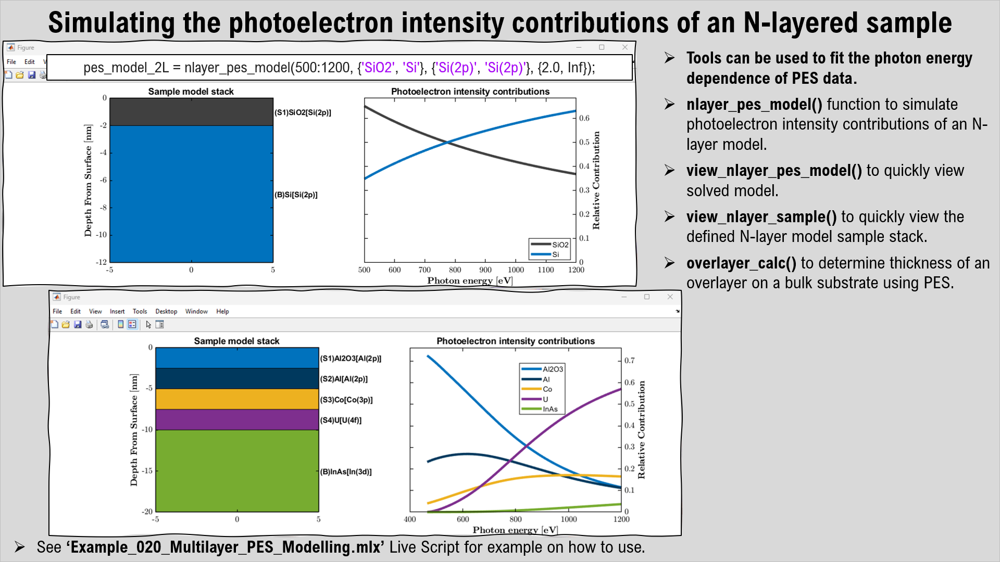
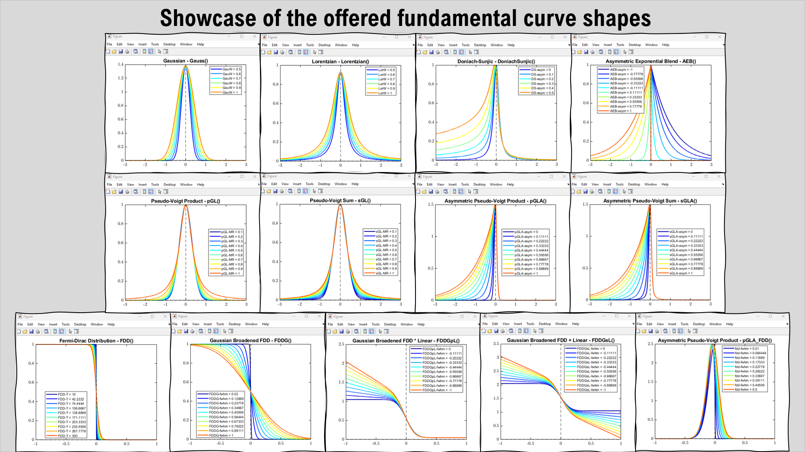
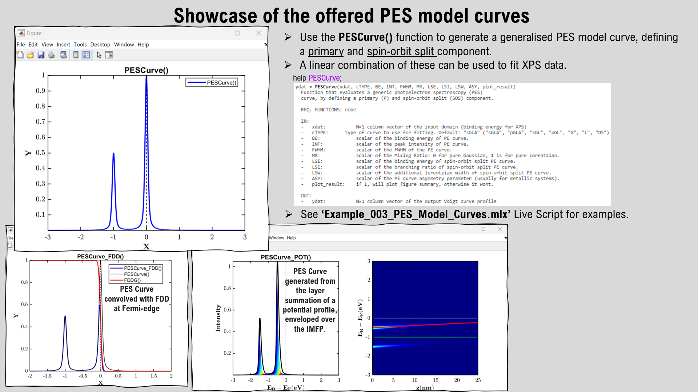
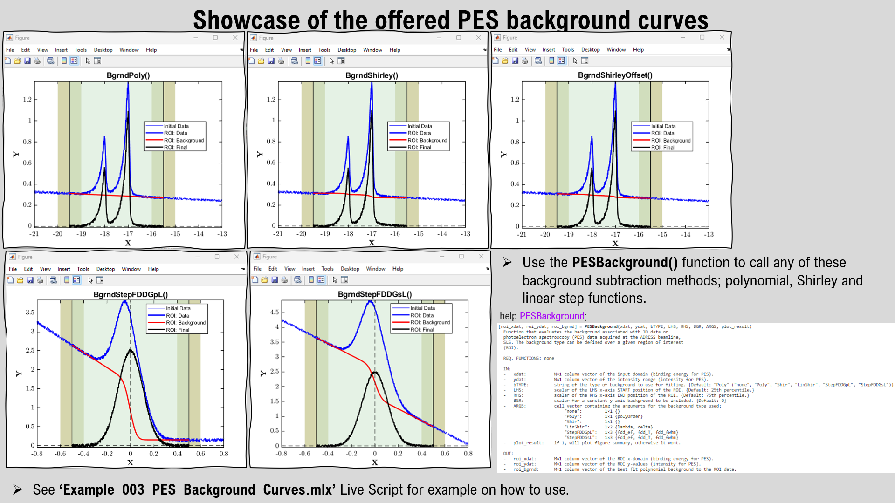
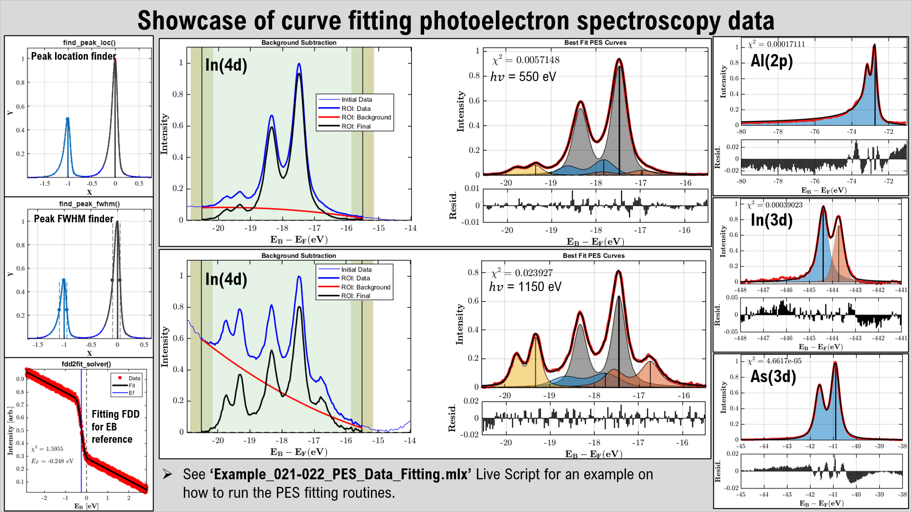
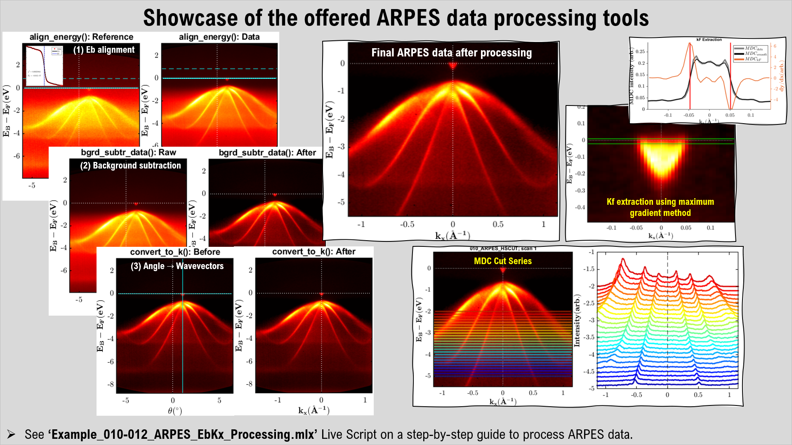
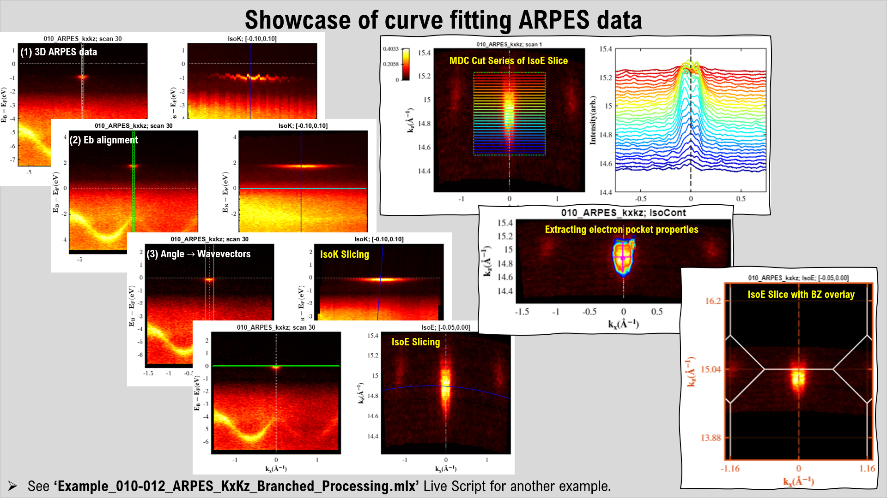
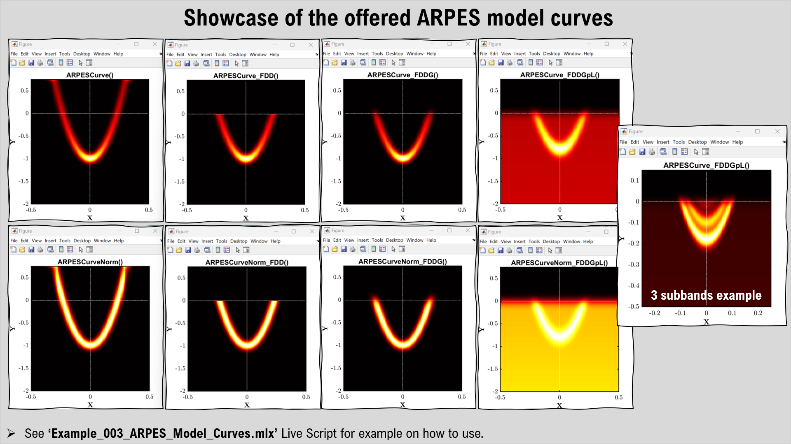
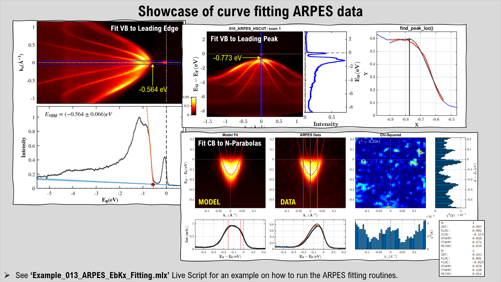
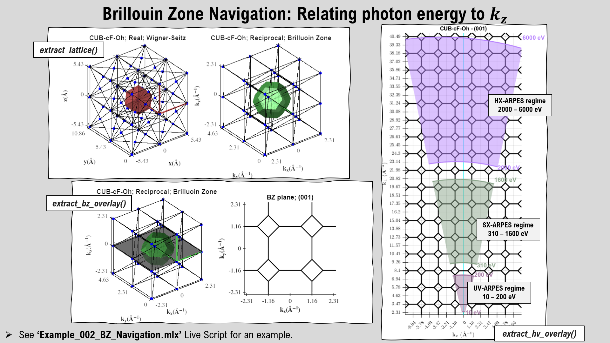

# ARPEScape: A suite of data analysis tools for photoelectron spectroscopy

[ARPEScape](https://github.com/c0deta1ker/ARPEScape) is a MATLAB-based app that contains a set of tools and functions for analysing the electronic structure of materials using photoelectron spectroscopy (PES) techniques, such as X-ray photoelectron spectroscopy (XPS) and angle-resolved photoelectron spectroscopy (ARPES). With ARPEScape, you can simulate, process, and fit PES data with various tools and functions. You can model, subtract, transform, and fit XPS spectra with different line-shapes and backgrounds. You can align, normalise, convert, and fit ARPES spectra with parabolic dispersions and estimate the Luttinger area. ARPEScape is compatible with the data format of the ADRESS beamline at the Swiss Light Source (SLS) in the Paul Scherrer Institute (PSI), but it can also be adapted to other data formats. ARPEScape is designed for researchers who want to explore PES data in a user-friendly and comprehensive way. Download ARPEScape today and may the residuals be minimised in all your fitting endeavours!

To enhance your experience, we recommend downloading [MatBase](https://github.com/c0deta1ker/MatBase), a MATLAB-based app that lets you explore, analyze and extract the properties and photoelectron spectroscopy parameters of various materials. [MatBase](https://github.com/c0deta1ker/MatBase) is a powerful and convenient tool that can help you with your PES data analysis and it is used in some of the functions of ARPEScape.

## Installation  
1. Download the *ARPEScape* repository.
2. Open MATLAB and use *Set Path* in the *Home* tab to add the *ARPEScape* repository and all its sub-folders into its saved search paths.
3. Make sure you also use *Set Path* to add the repository / folder that contains all of your data to be loaded in.
4. In the *PESTools* folder, there is an *Examples* folder, which contains many ARPES / XPS data processing and curve fitting templates / examples that can be used. You should use this as a starting point.  

## Photoelectron Spectroscopy (PES) Analysis Tools
**PES Multilayer Modelling**:
We define function that allows the user simulate the photoelectron intensity contributions of an N-layered sample as a function of photon energy. This can be used to model PES data acquired versus photon energy. The function allows the user to define the material type of each layer, the thickness, the core-level being probed and then determines the emitted photoelectron intensity of each layer using the Beer-Lambert law. All the material, photoionisation and core-level parameters are extracted from [MatBase](https://github.com/c0deta1ker/MatBase).

**PES Model Curves**:
A whole suite of PES model curves are defined and available for the user to use within MATLAB. From Gaussian, Lorentzian, Voigt and Doniach-Sunjic curve shapes. Furthermore, the Fermi-Dirac Distribution (FDD) is also defined, as well as its Gaussian broadened and linear background form. Combining all of these together, the fundamental curve-shapes for PES curve fitting to XPS / ARPES data is possible. Functions for background subtracting PES data according to a polynomial or Shirley background is also available.

**PES Curve Fitting**:
The PESTools functions offer a host of different line-shapes and background that you can use for fitting PES spectra. The available functions are; (i) For PES curves: Gaussian, Lorentzian, Voigt, asymmetrical Voigt and Doniach-Sunjic functions are available; (ii) For Backgrounds: Linear, Shirley, Offset Shirley and linear step functions are available. A host of miscellaneous tools are also available; (i) peak location finder, (ii) full-width at half-maximum (FWHM) finder, (iii) Fermi-Dirac Distribution (FDD) fitter for binding energy referencing XPS data. The general objective of fitting PES data is to define an initial photoelectron spectrum that provides a reasonable first guess and then run an optimisation procedure to hone in to the best fit solution. Here, the general procedures are listed below;  
(1) Define the shape and properties of the N primary (+ spin-orbit if required) components to be fitted  
(2) Define the type of background to be used  
(3) Preview the initial conditions of the XPS curve fit model vs data (with 'pes2ncurve_view_init()')  
(4) If you are happy with the initial guess, run the optimisation algorithm (with 'pes2ncurve_solver()')  
(5) Extract the best fit variables of the converged fit and plot the final fit with residuals (with 'pes2ncurve_view_fit()')

## Angle-Resolved Photoelectron Spectroscopy (ARPES) Analysis Tools
**ARPES 2D Data Processing - MDC & EDC cutting**:
A suite of tools are available to process and analyse ARPES data, along with several miscellaneous tools that can crop, filter, smooth, correct and cut the data associated with the ARPES spectra. The 1st stage is to align the binding energies to the valence band maximum (or Fermi-edge), the 2nd is to normalise the intensity of the ARPES spectra over the scan parameter and the 3rd and final step is to convert the angles into wave-vectors.  

**ARPES 3D Data Processing - IsoE & IsoK slicing**:
Allows the user to load in single or multiple processed ARPES data-files so that a consistent iso-energetic map can be created even across multiple data-files (if scans were segmented, rather than a single whole scan). The 2D Brillouin-Zone slice can be defined and overlaid on top of the iso-energetic slice. Multiple corrections can also be performed; filtering, background subtraction, origin, shear, rotation, and scale corrections. There is also the option to determine the area over some threshold, so that the Luttinger Area can be determined to estimate the number density of electrons that are occupying the states.  

**ARPES Model Curves**:
A whole suite of ARPES model curves are defined and available for the user to use within MATLAB. These are 2D parabolic dispersions that have Gaussian spot profiles, whose FWHM along the x- and y-axes can be defined. Furthermore, the Fermi-Dirac Distribution (FDD) is also defined, as well as its Gaussian broadened and linear background form. Combining these, parabolic ARPES curves can be simulated and used for: (i) accurately fitting N quantum well states near the Fermi-edge or (ii) estimating the VBM position by fitting etc.

**ARPES State Fitting**:
Allows the user to walk through all of the fitting steps to parabolic features within ARPES spectra. The 1st stage is to load in the ARPES data, and perform any pre-fitting corrections (energy re-alignment, resampling, filtering and cropping). The 2nd stage is to crop around the region of interest and also some reference background with the same density of points. The option for polynomial background subtraction is also available using the reference background. The 3rd stage is to the perform the fitting to the parabolic feature using several different approaches and routines. The Fermi-Dirac distribution can be defined and used within the fitting constraints. A parabolic approximation can be set, whose parabolic trail can be used as a constraint to the fitting parameters to allow the solution to converge easier. Various constraints can also be placed on EDC and MDC cuts through the region of interest, but through trial-and-error, the best solution can be found.  

## Miscellaneous Tools 
**BZ Navigation**:
Allows the user to define any crystal geometry and to determine the Wigner-Seitz cell in real-space and the First Brilluoin-Zone in reciprocal space. Additionally, by defining the crystal planes (100), (010) or (001), planar cuts through the stacked Brillouin-Zone can be determined, which is important in the interpretation of ARPES spectra. By imposing the ARPES geometry and experimental variables, the user can define the photon energy being used and extract the ARPES cut/slice being probed through the 2D Brillouin-Zone. This is very useful when it comes to finding what photon energies are needed to probe certain high-symmetry lines or valleys.

**ADRESS Job File Generators**:
Allows the user to generate custom job-files in the form of a text-file that is compatible to use in the 'Restore Tab' button on 'SmartGUI' at the ADRESS beamline. This allows the user to very quickly create a list of ARPES / PES scans to be taken as a function of photon energy, time or position, where each scan can be referenced to a known Fermi-edge, if desired. List of available job file generators:  
- 'ADRESS_JobFileGenerator_CLvsTIME()'  
- 'ADRESS_JobFileGenerator_CLvsHV()'  
- 'ADRESS_JobFileGenerator_CLvsPOS()'  

**Data Loaders**:
A MATLAB data loader for the ARPES / PES data acquired at the ADRESS, SIS and PEARL beamlines in the Swiss Light Source (SLS) are all available. 
- 'load_adress_data()'  
- 'load_sis_data()'  
- 'load_pearl_data()'  

## MATLAB Version control  
MATLAB version:   2022a  
MATLAB add-ons (recommended): Database Toolbox, Image Processing Toolbox, Global Optimization Toolbox, Optimization Toolbox, Curve Fitting Toolbox, Parallel Processing Toolbox, Statistics and Machine Learning Toolbox, Signal Processing Toolbox.

## Authors
PESTools Scripts:  
**Dr. Procopios Constantinou**,  
Swiss Light Source (SLS),  
Paul Scherrer Institute (PSI),  
email: procopios.constantinou@psi.ch

MATools Scripts:  
**Dr. Vladimir Strocov**,  
Swiss Light Source (SLS),  
Paul Scherrer Institute (PSI),  
email: vladimir.strocov@psi.ch

## Acknowledgments
'load_cassiopee' functions:  
Dr. Mengyu Yao,  
Max Planck Institute for Chemical Physics of Solids,  
email: Mengyu.Yao@cpfs.mpg.de  

## License  
This project is licensed under the GNU General Public License v3.0 - see the [LICENSE.md](LICENSE.md) file for details.

--PCC, July 2023